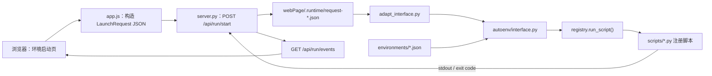

# Web 与 adapt interface 使用说明

本文具体说明 AutoEnv 的网页如何与 Python 环境脚本配合，重点回答三个问题：

1. Web 使用了什么框架；
2. 点击“拉起环境”后，Python 程序如何被触发；
3. 已注册环境如何按照脚本声明，转换成 SSH、Telnet、FTP、HDFS 和普通参数。

本文描述的是当前 `webPage/` 实现。`frontend/` 是历史原型，不参与当前调用链。

## 1. Web 框架是什么

当前 Web 没有使用 Flask、Django、FastAPI、React、Vue 或 Node 构建链，而是由两部分组成：

- 前端：`webPage/index.html`、`webPage/app.js` 和 CSS，使用浏览器原生 HTML、JavaScript、`fetch()`；
- 后端：`webPage/server.py`，使用 Python 标准库 `ThreadingHTTPServer` 和 `SimpleHTTPRequestHandler`。

入口命令是：

```powershell
python -X utf8 startWeb.py
```

`startWeb.py` 直接调用 `webPage.server.main()`。默认地址为：

```text
http://127.0.0.1:8765/
```

服务端同时承担两类职责：

- 把 `webPage/` 目录作为静态文件目录，返回 HTML、JavaScript 和 CSS；
- 提供 `/api/...` JSON 接口，完成环境保存、脚本发现、任务启动、输出轮询和终止。

默认只监听 `127.0.0.1`，且没有登录鉴权。它是本机开发控制台，不应直接改为 `0.0.0.0` 暴露到局域网或公网。

## 2. 主要模块与职责

| 模块 | 职责 |
|---|---|
| `startWeb.py` | 启动本地 HTTP 服务 |
| `webPage/index.html` | 环境库、环境启动、Tools、Agent CLI 页面结构 |
| `webPage/app.js` | 表单渲染、按钮事件、构造请求、轮询输出 |
| `webPage/server.py` | HTTP API、环境 JSON 校验、Python 子进程管理 |
| `adapt_interface.py` | 把 JSON/CLI 参数转换成 `LaunchRequest`，调用 interface 层 |
| `autoenv/interface.py` | 加载环境、按标签绑定资源、合并参数、非交互启动脚本 |
| `autoenv/registry.py` | 发现 `scripts/*.py`、读取脚本元数据、运行已注册脚本 |
| `autoenv/runtime.py` | 让 `ctx.register_ssh_host()` 等方法读取结构化参数 |
| `environments/*.json` | Web 保存的本机环境档案，默认不提交 Git |
| `webPage/.runtime/*.json` | Web 为每次启动生成的临时请求文件，默认不提交 Git |

整体调用关系如下：



## 3. 页面加载时，Python 如何告诉 Web 有哪些脚本

页面初始化后，`app.js` 请求：

```http
GET /api/scripts
```

`server.py` 调用 `autoenv.registry.list_scripts()`。注册表会导入并发现 `scripts/*.py`，但不会执行环境函数。每个 `@register_script(...)` 会提供：

- `name`：脚本注册名；
- `description`：脚本下拉框说明；
- `resources`：SSH/Telnet/FTP 交互资源；
- `package_inputs`：HDFS 包输入；
- `parameters`：普通脚本参数。

例如：

```python
from autoenv import SSHDefaults, TelnetDefaults, package, register_script


@register_script(
    name="start_demo",
    description="启动演示环境",
    packages=({
        "name": "A1",
        "alias": "A1 主安装包",
        "description": "从 HDFS 下载的演示安装包。",
    },),
    parameters=({
        "name": "release_channel",
        "label": "发布通道",
        "placeholder": "debug 或 release",
        "required": True,
    },),
    resources=(
        {
            "name": "dut_ssh",
            "alias": "1260 管理网口",
            "description": "用于上传安装包并执行启动命令。",
            "label": "1260网口",
            "protocol": "ssh",
        },
        {
            "name": "dut_console",
            "alias": "1260 调试串口",
            "description": "用于查看设备启动输出。",
            "label": "1260串口",
            "protocol": "telnet",
        },
    ),
)
def start_demo(ctx):
    image = package("A1")
    host = ctx.register_ssh_host(
        "dut_ssh",
        resource_label="1260网口",
        defaults=SSHDefaults(),
    )
    console = ctx.register_telnet(
        "dut_console",
        resource_label="1260串口",
        defaults=TelnetDefaults(),
    )

    release_channel = ctx.argument("release_channel", required=True)
    result = ctx.download_package(image)
    if not result.success:
        return result
    result = host.execute("/root/start.sh", timeout=600)
    if not result.success:
        return result
    return console.execute(f"show status {release_channel}", timeout=30)
```

选择该脚本后，`app.js` 根据元数据动态生成：

- 两个环境资源下拉框：`1260 管理网口`、`1260 调试串口`；
- 一个 HDFS 链接输入：`A1 主安装包`；
- 一个普通输入：`发布通道`。

这里的 `name` 是 Python 内部绑定名；`alias` 和 `description` 才是主要的页面提示。

## 4. 如何注册一个可供脚本选择的环境

在“环境库”页面填写环境并点击“保存环境”时，`app.js` 发送：

```http
POST /api/environments
Content-Type: application/json
```

请求示例：

```json
{
  "name": "lab_a",
  "title": "A 机柜验证环境",
  "ssh_hosts": {
    "rack_mgmt": {
      "resource_label": "1260网口",
      "host": "192.168.10.11",
      "port": 22,
      "username": "root",
      "password": "example-password",
      "connect_timeout": 30
    }
  },
  "telnet_connections": {
    "rack_console": {
      "resource_label": "1260串口",
      "host": "192.168.10.21",
      "port": 2001,
      "baud_rate": 115200,
      "timeout": 30,
      "shell_mode": "auto"
    }
  },
  "ftp_hosts": {}
}
```

服务端校验后写入 `environments/lab_a.json`。

### 4.1 环境逻辑名与脚本逻辑名的区别

上例环境内部使用 `rack_mgmt`、`rack_console`，脚本使用 `dut_ssh`、`dut_console`。两组名字不要求相同。

绑定过程不会按环境内部逻辑名匹配，而是按以下条件匹配：

1. 协议对应的环境分区；
2. 固定 `resource_label`。

例如脚本资源：

```json
{"name": "dut_ssh", "label": "1260网口", "protocol": "ssh"}
```

会在所选环境的 `ssh_hosts` 中寻找唯一的 `1260网口`。找到 `rack_mgmt` 后，把它的连接参数复制并改用脚本名 `dut_ssh` 传给运行时。

环境内部逻辑名主要用于环境档案可读性和页面下拉选项展示；脚本逻辑名用于 Python 代码取值。

### 4.2 固定资源标签

当前资源标签是静态目录：

- `1260网口`、`1260串口`；
- `1712网口`、`1712串口`；
- `udie1网口`、`udie1串口`。

规则是：

- SSH、FTP 只能使用网口标签；
- Telnet 只能使用串口标签；
- 同一环境不能重复注册同一个标签；
- 脚本选择环境后，该环境必须恰好包含一个匹配资源。

`baud_rate` 当前只是串口档案元数据。Telnet 客户端连接 TCP 端口，不会自动修改串口服务器的物理波特率。

## 5. 点击“拉起环境”如何触发 Python

“拉起环境”是 `launchForm` 的提交按钮。`app.js` 阻止浏览器默认提交行为，然后读取所有动态控件：

- `[data-resource]` → `environments`；
- `[data-package]` → `parameters.packages`；
- `[data-argument]` → `parameters.arguments`。

构造出的请求类似：

```json
{
  "script": "start_demo",
  "mode": "run",
  "environments": {
    "dut_ssh": {"environment": "lab_a"},
    "dut_console": {"environment": "lab_a"}
  },
  "parameters": {
    "packages": {
      "A1": {"path_override": "/compilepackage/demo/20260815/"}
    },
    "arguments": {
      "release_channel": "debug"
    }
  }
}
```

随后发送 `POST /api/run/start`。

### 5.1 server.py 做了什么

`server.py` 不在 HTTP 线程中直接执行环境脚本，而是：

1. 把请求写入 `webPage/.runtime/request-<uuid>.json`；
2. 使用当前 Python 解释器启动固定入口：

```text
python -X utf8 adapt_interface.py --request <request-json-path>
```

3. 将工作目录固定为项目根目录；
4. 合并 stderr 到 stdout，并以 UTF-8、非缓冲模式逐行读取；
5. 立即向浏览器返回 `{"ok": true}`。

因此，`POST /api/run/start` 成功只表示子进程已启动，不表示环境已经启动成功。最终成功与否要看输出事件和子进程退出码。

### 5.2 adapt_interface.py 做了什么

`adapt_interface.py` 读取 JSON，然后依次调用：

```text
LaunchRequest.from_dict()
    ↓
autoenv.interface.launch()
    ↓
registry.run_script(non_interactive=True)
```

脚本运行结束后，它把 `ScriptResult` 输出为 JSON。成功退出码为 `0`，失败退出码为 `1`。

### 5.3 页面如何持续显示输出

`ProcessSession` 在后台线程中读取子进程 stdout，把每一行保存为 `output` 事件；进程结束时追加 `complete` 事件。

前端大约每 60 毫秒轮询：

```http
GET /api/run/events?cursor=<上次位置>
```

页面按 `next` 游标只读取新增事件。点击“终止”会请求 `POST /api/run/stop`；服务端先 `terminate()`，两秒内未退出则 `kill()`。

## 6. 已注册环境如何变成脚本参数

核心逻辑位于 `autoenv.interface.bind_environments()`。

以前面的请求为例，绑定过程如下：

| 脚本资源名 | 协议 | 标签 | 所选环境 | 查找分区 | 匹配环境资源 |
|---|---|---|---|---|---|
| `dut_ssh` | `ssh` | `1260网口` | `lab_a` | `ssh_hosts` | `rack_mgmt` |
| `dut_console` | `telnet` | `1260串口` | `lab_a` | `telnet_connections` | `rack_console` |

绑定后的结构相当于：

```json
{
  "ssh_hosts": {
    "dut_ssh": {
      "resource_label": "1260网口",
      "host": "192.168.10.11",
      "port": 22,
      "username": "root",
      "password": "example-password",
      "connect_timeout": 30
    }
  },
  "telnet_connections": {
    "dut_console": {
      "resource_label": "1260串口",
      "host": "192.168.10.21",
      "port": 2001,
      "baud_rate": 115200,
      "timeout": 30,
      "shell_mode": "auto"
    }
  }
}
```

然后 `merge_parameters()` 合并 Web 输入，形成传给 `run_script()` 的完整参数：

```json
{
  "ssh_hosts": {
    "dut_ssh": {
      "resource_label": "1260网口",
      "host": "192.168.10.11",
      "port": 22,
      "username": "root",
      "password": "example-password",
      "connect_timeout": 30
    }
  },
  "telnet_connections": {
    "dut_console": {
      "resource_label": "1260串口",
      "host": "192.168.10.21",
      "port": 2001,
      "baud_rate": 115200,
      "timeout": 30,
      "shell_mode": "auto"
    }
  },
  "ftp_hosts": {},
  "packages": {"A1": {"path_override": "/compilepackage/demo/20260815/"}},
  "arguments": {"release_channel": "debug"}
}
```

`baud_rate` 会随环境档案进入结构化参数，但当前 `register_telnet()` 只消费
`host`、`port`、`timeout` 和 `shell_mode`；它不会修改物理串口频率。

运行脚本时，各接口按固定分区和逻辑名取值：

| Python 调用 | 参数来源 |
|---|---|
| `register_ssh_host("dut_ssh")` | `parameters.ssh_hosts.dut_ssh` |
| `register_telnet("dut_console")` | `parameters.telnet_connections.dut_console` |
| `register_ftp_host("name")` | `parameters.ftp_hosts.name` |
| `download_package(package("A1"))` | `parameters.packages.A1`；空对象时使用 `config.json` |
| `argument("release_channel")` | `parameters.arguments.release_channel` |

Web 启动使用 `non_interactive=True`。缺少必填环境、包路径来源或普通参数时会直接失败，不会在后台子进程中回退到 `input()` 等待用户输入。

## 7. 多环境脚本如何传参

`environments` 以脚本资源逻辑名为键，因此同一脚本可以从不同环境选择资源：

```json
{
  "script": "start_combined",
  "mode": "run",
  "environments": {
    "host_1260": {"environment": "rack_a"},
    "console_1260": {"environment": "rack_a"},
    "host_1712": {"environment": "rack_b"},
    "console_udie1": {"environment": "rack_c"}
  },
  "parameters": {
    "packages": {
      "A1": {},
      "A2": {"path_override": "/compilepackage/A2/fixed-build/"}
    },
    "arguments": {}
  }
}
```

每个资源分别执行“所选环境 + 协议 + 标签”的唯一匹配，不再假设一个脚本只能对应一个环境。

## 8. HDFS 链接如何传给脚本

脚本通过 `packages` 声明 Web 输入：

```python
packages=({
    "name": "A1",
    "alias": "A1 主安装包",
    "description": "环境启动需要的主安装包。",
},)
```

页面输入非空时发送：

```json
"packages": {"A1": {"path_override": "/hdfs/path/from/web/"}}
```

页面留空时发送：

```json
"packages": {"A1": {}}
```

运行时的选择顺序是：

1. 有 `path_override`：使用 Web 指定路径；
2. 否则 `config.json` 有 `link`：使用固定 `link`；
3. 否则有 `base_link`：自动解析最新目录；
4. 三者都没有：非交互启动失败。

## 9. 不通过网页，直接调试 adapt interface

推荐先写一个请求文件 `request.json`：

```json
{
  "script": "start_demo",
  "mode": "run",
  "environments": {
    "dut_ssh": {"environment": "lab_a"},
    "dut_console": {"environment": "lab_a"}
  },
  "parameters": {
    "packages": {"A1": {}},
    "arguments": {"release_channel": "debug"}
  }
}
```

然后执行：

```powershell
python -X utf8 adapt_interface.py --request .\request.json
```

`adapt_interface.py` 还保留旧的单环境参数入口：

```powershell
python -X utf8 adapt_interface.py `
  --script start_demo `
  --mode run `
  --environment lab_a `
  --parameters '{"packages":{"A1":{}},"arguments":{"release_channel":"debug"}}'
```

多环境场景应使用 `--request`，因为独立 CLI 参数没有 `--environments` 选项。

注意：以上命令会真实执行注册脚本。只验证脚本是否可被发现时，应使用：

```powershell
python -X utf8 -c "from autoenv.registry import list_scripts; print([item.name for item in list_scripts()])"
```

## 10. 常用 API

| 方法 | 作用 |
|---|---|
| `GET /api/health` | 检查本地服务和项目根目录 |
| `GET /api/resource-labels` | 读取固定资源标签 |
| `GET /api/environments` | 读取所有本机环境档案 |
| `POST /api/environments` | 校验并保存一个环境档案 |
| `GET /api/scripts` | 发现脚本及其 Web 元数据 |
| `POST /api/run/start` | 写请求文件并启动 adapt 子进程 |
| `GET /api/run/events?cursor=N` | 增量读取运行输出 |
| `POST /api/run/stop` | 终止当前环境任务 |
| `POST /api/open` | 打开最近运行目录或日志 |

## 11. 常见错误如何定位

### 11.1 下拉框显示“没有环境注册了该标签”

检查脚本的协议/标签、环境对应分区和环境是否保存成功。

### 11.2 `requires an environment binding`

脚本声明了资源，但请求的 `environments` 没有对应脚本逻辑名。

### 11.3 `must contain exactly one ... resource`

所选环境在正确协议分区中没有匹配标签，或环境文件被手工改坏。Web 保存接口本身会拒绝同一环境重复标签。

### 11.4 页面收到 `{"ok": true}`，但环境随后失败

`ok` 只表示 Python 子进程成功创建。继续查看 LIVE TASK OUTPUT、`run.log` 和最终 `result.json`。

### 11.5 脚本停在启动后的 func 菜单

`register_func` 是 CLI 交互菜单，当前环境启动页没有 func 选择控件。面向 Web 的主流程不应依赖该菜单完成；完整示例见 `scripts/template.py`。

## 12. 安全和数据边界

- 环境密码按当前项目约定明文保存在 `environments/*.json`；该目录默认被 Git 忽略；
- 请求文件保存在 `webPage/.runtime/`，也默认被 Git 忽略；
- 服务端只启动固定的 `adapt_interface.py`，页面不能直接提交任意 Python 文件路径；
- Web 没有用户登录、权限隔离或 CSRF 防护，只适合本机可信开发场景；
- `POST /api/run/stop` 会终止当前 AutoEnv 子进程，可能使远端操作停在中间状态；
- 离线测试只能验证参数和控制面契约，不能证明真实 SSH、Telnet、FTP 或 HDFS 环境可用。

## 13. 相关文档与代码

- 快速操作：[`../webPage/QUICK_START.md`](../webPage/QUICK_START.md)
- Web 架构边界：[`WEB_ARCHITECTURE_AND_HANDOFF.md`](WEB_ARCHITECTURE_AND_HANDOFF.md)
- 环境脚本写法：[`ENVIRONMENT_REGISTRATION_GUIDE.md`](ENVIRONMENT_REGISTRATION_GUIDE.md)
- 全接口脚本模板：[`../scripts/template.py`](../scripts/template.py)
- adapt 入口：[`../adapt_interface.py`](../adapt_interface.py)
- 参数绑定实现：[`../autoenv/interface.py`](../autoenv/interface.py)
- HTTP 服务：[`../webPage/server.py`](../webPage/server.py)
- 前端按钮逻辑：[`../webPage/app.js`](../webPage/app.js)
