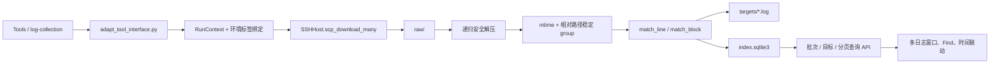

# 日志自动收集与关联分析 workflow Tool

## 变更目的

把日志下载、递归安全解压、稳定排序、组件分类、时间索引和 Web 关联查询做成 AutoEnv 的可复用能力，并通过 Tools 页提供独立 workflow 入口。

本功能替代未完成的 `scripts/download_and_parse_logs.py`。日志采集不再作为环境启动脚本注册，因此不会出现在“环境启动”下拉框；尚未描述的功能2未实现。

## 用户可见行为

Tools 页新增“日志收集与关联分析”：

1. 选择包含 `1260网口` 的已注册环境。
2. 输入远端日志目录和可选批次别名。
3. 点击“获取日志”，后台独立进程通过 SCP 下载远端当前目录内全部 `cpdt_*` 文件。
4. 系统递归解压并匹配 `cpdt*.log`，生成：
   - `auth.log`：匹配 `\[AUTH\]` 的行；
   - `database.log`：匹配 `\[DB\] BEGIN` 到 `\[DB\] END` 的块。
5. 成功批次可以按文件顺序分页浏览，或按共享日期、中心时间和时间窗查询。
6. 可以同时打开多个目标日志窗口；选择一条有时间的记录后，其他窗口内相差不超过五分钟的已显示记录自动高亮。
7. 每个日志窗口都有独立的 `Find` 输入框：在整个 target file 中进行最长 200 字符、不区分大小写的字面关键词筛选，与时间条件取交集，并高亮正文中的全部命中片段。

## 数据流



每次 workflow 运行使用唯一 `run_id`，批次目录为：

```text
logs/<run_id>/log_collection/
├── raw/                 # 原始 SCP 下载文件
├── expanded/            # 原文件副本及递归解压结果
├── targets/             # auth.log、database.log 等分类输出
├── index.sqlite3        # 规范化逐行索引
└── manifest.json        # 无密码批次清单
```

只有成功执行 `finalize()`、且 manifest 状态为 `ready` 的批次可以查询。别名允许重复，`run_id` 始终唯一。

## 公共接口

### workflow Tool

`register_web_tool()` 新增：

- `kind="local"`：兼容原有 values → JSON 工具；
- `kind="workflow"`：函数接收 `RunContext`，在独立子进程运行；
- `renderer="log_collection"`：启用日志批次查询界面；
- workflow 的资源从字面量 `ctx.register_*()` 调用静态发现，并沿用环境标签绑定。

Tools 和 scripts 使用独立注册表。`list_scripts()` 永远不会返回 Tool。

### 日志 SDK

```python
collection = ctx.create_log_collection(alias="可选别名")
collection.download(host, remote_dir="/var/log/product", glob="cpdt_*", protocol="scp")
collection.extract_all()
group = collection.group(glob="cpdt*.log", timestamp=TimestampPattern(...))
group.match_line(regex, "target.log")
group.match_block(begin_regex, end_regex, "target.log")
collection.finalize()
```

`SSHHost.scp_download_many()` 负责远端普通文件枚举、mtime 获取、稳定排序、逐文件大小校验和 `.part` 原子替换。零匹配或部分失败会返回失败结果并清理本批下载文件。

### 查询 API

```text
GET /api/log-batches
GET /api/log-batches/targets?batch=<run_id>
GET /api/log-batches/query?batch=<run_id>&target=auth.log&page=1&limit=200
    &date=2026-08-16&time=08:21:00&window=60&keyword=login
```

`window=60` 表示中心前后各 30 分钟。`keyword` 为空时不筛选；非空时搜索整个目标日志正文，而不是仅搜索当前页。

## 关键解析语义

- 时间正则使用 `year/month/day/hour/minute/second` 命名组；`hour`、`minute` 必须存在，其余可缺失。
- 每个源文件独立维护时间状态，文件之间不继承。
- `match_line()` 会扫描所有原始行更新时间；匹配行无时间时继承本文件上一时间，仍无时间输出 `[-]`。
- `match_block()` 排除 begin/end 行。显式 begin 丢弃此前隐式暂存；块内后续 begin 忽略。
- 显式块统一使用 begin 时间；隐式块使用块内第一个时间，否则继承块前时间。
- 按已确认样例，显式未闭合块在 EOF 输出并标记 `incomplete_block`；最后一个 end 后未再次出现显式 begin 的隐式尾段不在 EOF 输出。
- 同一 target 的多条规则按源文件顺序、源行号、规则声明顺序合并。
- 输出前缀为完整时间、部分时间或 `[-]`，例如 `[2026-08-16 08:21:03]`、`[08:21:03]`、`[-]`。
- 默认编码顺序为 UTF-8、UTF-8-SIG、GB18030、Latin-1；实际编码写入 manifest。

## 安全边界

- ZIP、GZ、TAR.GZ、TGZ 支持递归展开。
- 拒绝路径穿越、绝对路径、链接、特殊文件、重复成员和父子路径冲突。
- 默认最多展开 10,000 个文件、总计 5 GiB；超限时中止并清理当前展开目录。
- target 文件名必须是不含目录的安全 `.log` 文件名。
- workflow 只能通过 `RunContext` 和 AutoEnv SDK 使用声明的环境资源；Tool 不直接使用 Paramiko、socket 或任意 shell。
- Web 仍只面向可信本机使用；环境密码可能保存在既有环境档案中，但不会写入日志批次 manifest。

## 主要文件

| 文件 | 职责 |
|---|---|
| `autoenv/logs.py` | 日志批次、时间模式、安全解压、group、line/block 规则、目标文件与 SQLite finalize |
| `autoenv/log_query.py` | 批次/目标列表、分页、日期时间窗、跨午夜和关键词查询 |
| `autoenv/ssh_host.py` | 批量 SCP 下载与远端 mtime 元数据 |
| `autoenv/web_tools.py` | local/workflow Tool 注册与统一运行结果 |
| `adapt_tool_interface.py` | workflow Tool 的结构化子进程入口与环境绑定 |
| `webPage/tools/log_collection.py` | 固定的 cpdt/AUTH/DB 业务规则 |
| `webPage/server.py` | workflow 启停/事件及日志查询 HTTP API；Web 端口改为独占监听 |
| `webPage/app.js`、`webPage/logs.css` | 批次选择、多窗、分页、时间联动、每窗 Find 与命中高亮 |
| `tests/test_log_collection.py` | 三份确认样例的精确输出及日志 SDK/查询/workflow 测试 |

## 验证结果

完成时的离线验证：

- 本次合并提交的最终完整 pytest：`269 passed, 1 skipped`；跳过项是当前 Windows 主机不允许创建符号链接的既有测试。
- 日志样例精确断言 `auth.log`、`database.log` 和 SQLite 行数/不完整块标记。
- 覆盖普通文件、GZ、ZIP、TAR.GZ、TGZ、递归解压、危险路径、链接、特殊文件、冲突和展开上限。
- 覆盖 line 时间继承、文件间不继承、未知时间、隐式/显式 block、重复 begin、EOF 未闭合块、完整/部分时间、跨午夜、分页和 Find+时间组合查询。
- 覆盖 SCP 多匹配、零匹配、远端 mtime、部分失败和临时文件清理。
- Python 编译、Tool 验证器、环境脚本契约、Skill 校验、JavaScript 语法和本地 HTTP API 冒烟均通过。

## 未执行与后续注意

- 没有在自动测试中连接真实 SSH/SCP；需选择一个明确授权、包含 `1260网口` 且具有样例日志的实验环境做最终冒烟。
- Web 固定且独占监听 `127.0.0.1:8765`；端口冲突会明确失败，不自动切换端口。应停止占用进程后通过唯一入口 `python -X utf8 startWeb.py` 重试。
- 新增组件或日志规则时修改 `webPage/tools/log_collection.py`，并为新的确认样例增加精确目标日志断言，不要在框架层猜测业务规则。
